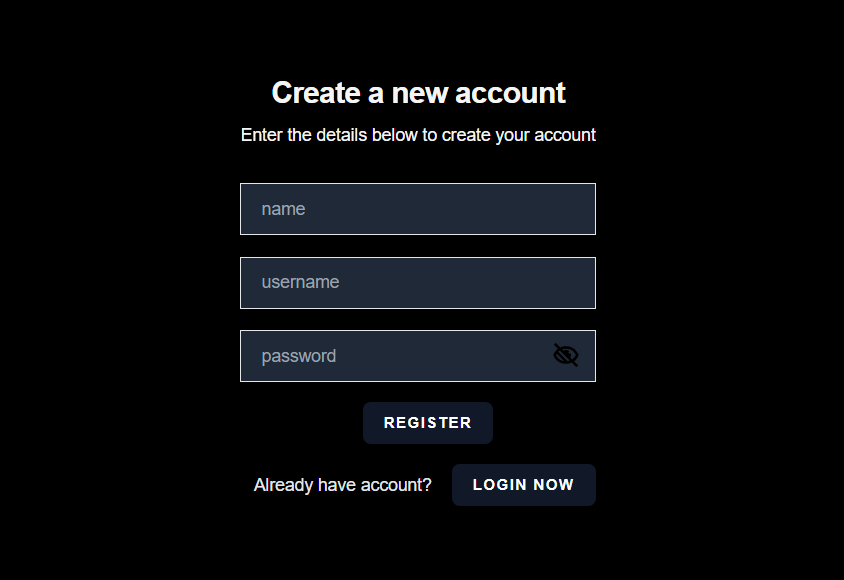
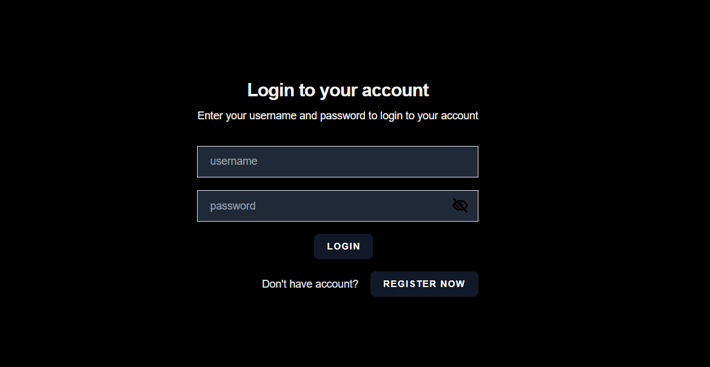
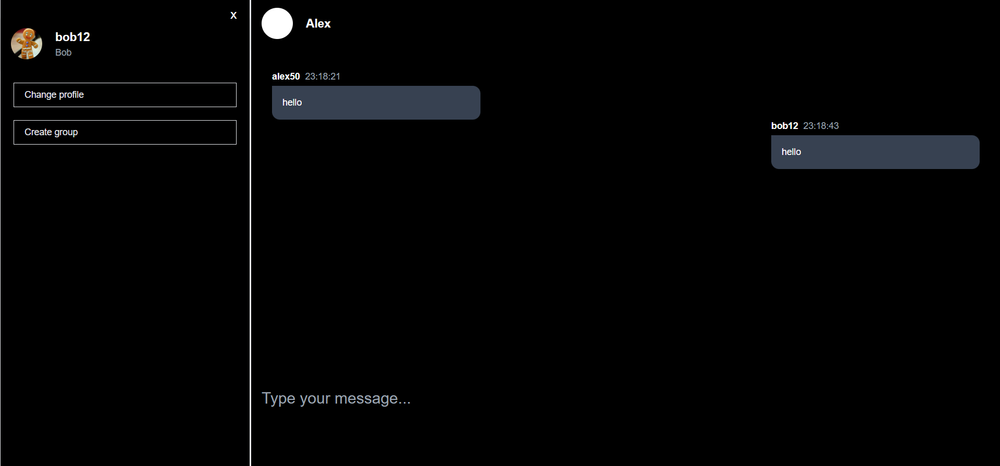
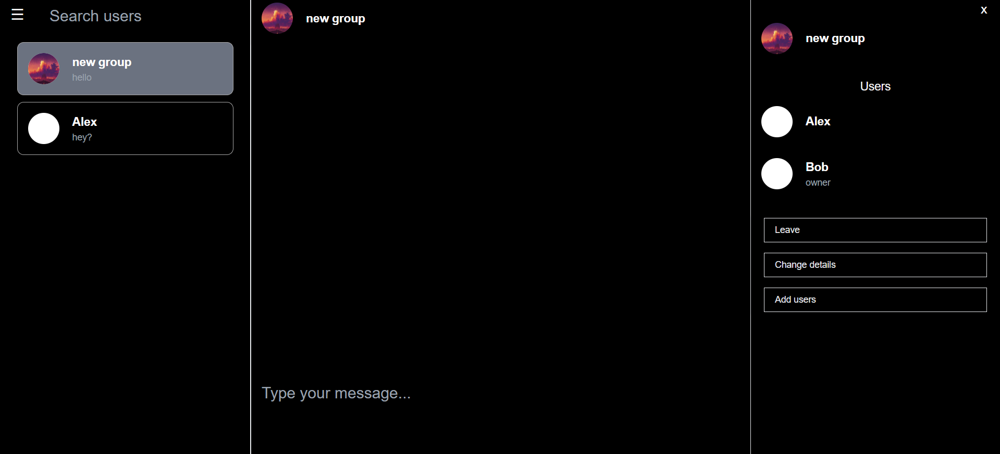

# Web chat 

### Overview
Web chat where you can search for and chat with other people. It is possible to create groups and customize them. You can also edit and delete your messages and customize your profile. This project is a full-stack web application. The frontend is developed using React and the [backend](https://github.com/StudentPP1/chat-app-backend.git) is developed using Spring Boot.

### Demo
Here’s a quick demo of how the project works:

## Login Page

##

## User profile

##

## Chat

##
